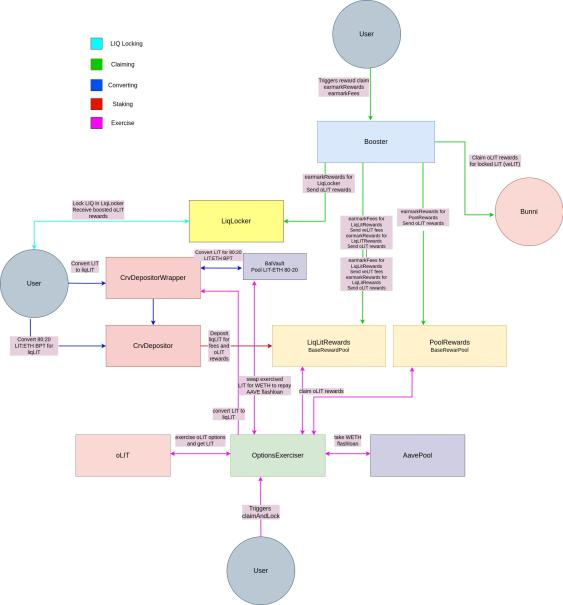

# Liquis Finance

[](https://github.com/liquisfi/liquis-contracts/actions/workflows/test-coverage.yaml)

## Security

Liquis Finance codebase is based on smart contracts developed and used in production by DeFi champions Convex and Aura. Just like these teams we take security very seriously, [see Security documentation](https://docs.liquis.app/the-protocol/security) .

If you have any feedback or concerns, reach out to our security [at] liquis.app.

## Dev

### Install

```sh
$ yarn install
```

### Compile

Compile the smart contracts with Hardhat:

```sh
$ yarn compile
```

### TypeChain

Compile the smart contracts and generate TypeChain artifacts:

```sh
$ yarn typechain
```

### Lint Solidity

Lint the Solidity code:

```sh
$ yarn lint:sol
```

### Lint TypeScript

Lint the TypeScript code:

```sh
$ yarn lint:ts
```

### Test

Run the Mocha tests:

```sh
$ yarn test
```

Run fork tests

```sh
$ yarn test:fork:all
```

### Tasks

Running in fork mode

```sh
$ NODE_URL=<FORK_URL> yarn task:fork <TASK_NAME>
```

Running task normally

```
$ NODE_URL=<NODE_URL> yarn task --network <NETWORK> <TASK_NAME>
```

### Coverage

Generate the code coverage report:

```sh
$ yarn coverage
```

### Clean

Delete the smart contract artifacts, the coverage reports and the Hardhat cache:

```sh
$ yarn clean
```

## Local Fork

This runs a local node on your system, that can be used with Metamask, etc.

Run a local fork:

```
npx hardhat node --fork https://eth-mainnet.alchemyapi.io/v2/<API_KEY> --port <PORT>
```

Once you stake or lock CVX you may want to progress timestamps to check rewards stuff

```
export NODE_URL=<LOCAL_NODE_URL>
yarn task timeTravel --duration 69420 --network forking
```

## Diagrams

[Booster Reward Flow](./liquis-reward-flow.JPG)


## Deployments

See docs for the list of mainnet contract addresses.
